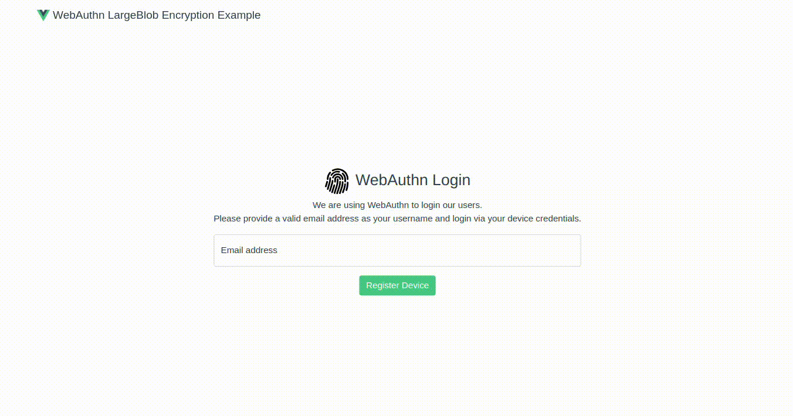
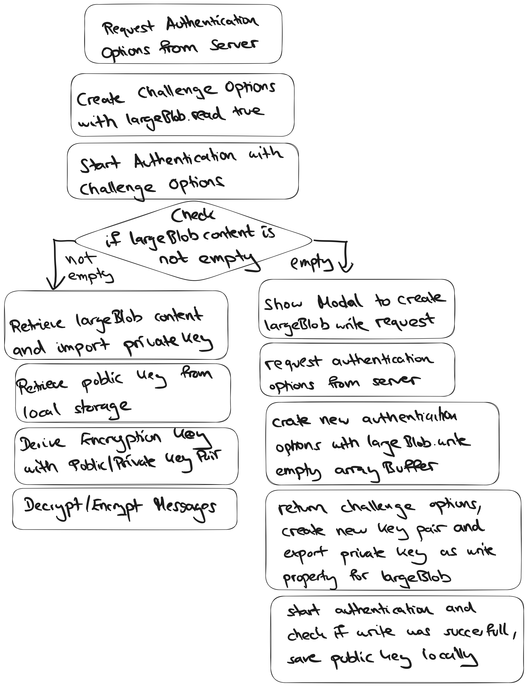

# webauthn-largeBlob-encryption

#### working draft

## important source files

- /backend/src/webauthn/index.ts -> all functions for creating registration and authentication options

- /frontend/src/services/webauthn.ts -> all functions for handling the challenge options

- /frontend/src/services/crypto.ts -> all functions to derive encryption key and encrypt or decrypt messages

- /frontend/src/views/Home.vue -> all event handling from inputs

## workflow for retrieving and storing private key in large blob exxtension of webauthn

